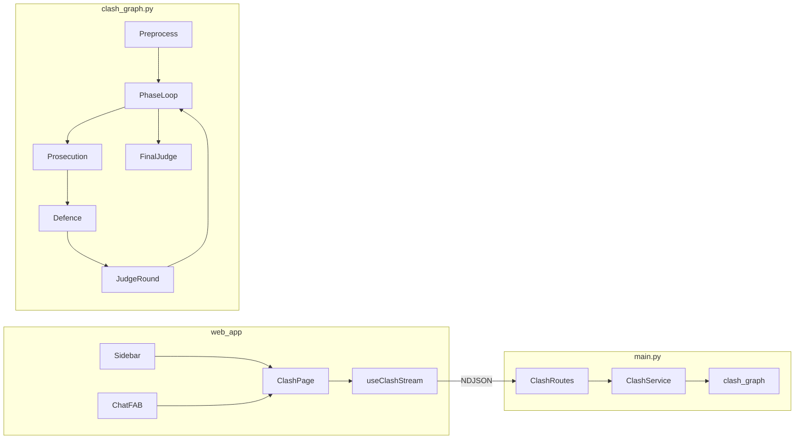

# Clash Mode — Implementation Plan

## Current baseline (no Clash code today)


| Layer          | Location                                                                                 | Relevant pattern                                                                                     |
| -------------- | ---------------------------------------------------------------------------------------- | ---------------------------------------------------------------------------------------------------- |
| Web UI         | `[web_app/](web_app/)`                                                                   | Next.js App Router; chat at `[web_app/app/(chat)/cases/page.tsx](web_app/app/(chat)`/cases/page.tsx) |
| Chat streaming | `[web_app/components/chat/ChatInterface.tsx](web_app/components/chat/ChatInterface.tsx)` | `fetch` + `ReadableStream` + **NDJSON** (`JSON.parse` per line); `type: "answer"` for tokens         |
| Dashboard nav  | `[web_app/components/dashboard/Sidebar.tsx](web_app/components/dashboard/Sidebar.tsx)`   | Flat `victimNavItems`; `hasSub` on File a Case is cosmetic only (no real dropdown yet)               |
| Chat FAB       | `[web_app/app/(dashboard)/layout.tsx](web_app/app/(dashboard)`/layout.tsx)               | Green FAB **bottom-right** opens chat overlay                                                        |
| API            | `[main.py](main.py)`                                                                     | All routes + Pydantic models; `POST /chat/stream` → `agent_graph.astream_events`                     |
| LangGraph      | `[agent_graph.py](agent_graph.py)`                                                       | `AgentState` + `MemorySaver`; **no** `interrupt()` usage yet                                         |
| LLM            | `[utils.py](utils.py)`                                                                   | Shared `llm` used by all agents                                                                      |


**Constraint honored:** No sensitivity/moderation gates. Clash stays isolated from the intake `supervisor` → `report_generator` pipeline.




---

## Architecture decision: separate graph + endpoints

Do **not** route Clash through `[agent_graph.py](agent_graph.py)` supervisor. Add:

- `[clash_graph.py](clash_graph.py)` — compiled `clash_graph` with its own `ClashState`
- `[clash_service.py](clash_service.py)` — session registry + stream/resume helpers
- `[clash_schemas.py](clash_schemas.py)` — Pydantic models (keeps `[main.py](main.py)` from growing another 500 lines)
- `[agents/clash/](agents/clash/)` — prosecution, defence, judge, preprocessor (separate prompts; no shared hidden instructions)

Register thin route handlers in `[main.py](main.py)` that delegate to `clash_service`.

**Thread ID:** `clash-{session_id}` in LangGraph config (separate from chat `session_id`).

---

## Data models (`[clash_schemas.py](clash_schemas.py)`)


| Model                | Purpose                                                                                                  |
| -------------------- | -------------------------------------------------------------------------------------------------------- |
| `ClashMode`          | `practice`                                                                                               |
| `ClashCaseInput`     | `title`, `facts`, optional `mock_case_id`                                                                |
| `ClashMockCase`      | id, title, summary, facts, tags                                                                          |
| `ClashSessionCreate` | mode, user_id                                                                                            |
| `ClashSession`       | session_id, mode, status, case, phase, round                                                             |
| `DebateRound`        | phase, prosecution/defence excerpts, `JudgeScore`                                                        |
| `JudgeScore`         | legal_accuracy, coherence, evidence_usage, procedural_soundness, phase_fulfillment, round_total          |
| `FinalClashResult`   | overall_score (0–100), confidence_band, mock_verdict, actionability, evidence_gaps, unresolved_questions |
| `ClashStreamEvent`   | envelope: `event_type`, `session_id`, `mode`, `agent_side`, `phase`, `payload`                           |
| `ClashQuestionEvent` | question_id, question_text, quick_replies?, phase                                                        |
| `ClashAnswerRequest` | session_id, question_id, answer                                                                          |
| `ClashResumeEvent`   | ack + optional log line                                                                                  |


**Agent side convention (UI alignment):**

- `prosecution` (Agent A / complainant) → transcript **RIGHT**
- `defence` (Agent B) → transcript **LEFT**
- `judge` → center/full-width score blocks (not side-aligned debate bubbles)

---

## LangGraph flow (`[clash_graph.py](clash_graph.py)`)

### State (`ClashState` TypedDict)

Core fields: `mode`, `case_facts`, `case_title`, `phase` (enum: opening → evidence → legal_arguments → rebuttal → closing), `round_number`, `messages`, `prosecution_output`, `defence_output`, `judge_notes`, `round_scores[]`, `final_score`, `verdict`, `pending_question`, `awaiting_user_input`, `question_agent_side`, `resumed_answer`, `user_answers[]`, `transcript_entries[]`.

### Nodes

1. `**preprocess_case`** — normalize facts; Practice may enrich from mock case metadata; Real Life adds disclaimer flags only (no moderation).
2. `**prosecution_turn`** — courtroom-style argument for current phase; may call `interrupt({...})` when facts insufficient.
3. `**defence_turn**` — opposing argument; same interrupt pattern.
4. `**judge_round**` — structured JSON rubric scores for the round (non-streaming or short stream).
5. `**final_judge**` — synthesis: overall score, confidence band, mock verdict, recommended next action (Real Life only adds strength framing).

### Edges (5 phases × 2 speakers + judge)

```text
START → preprocess_case → prosecution_turn → defence_turn → judge_round
  → (next phase or final_judge) → END
```

Conditional routing after each speaker:

- If node set `awaiting_user_input` via `interrupt()` → graph pauses (checkpoint retains state).
- On `Command(resume=answer)` → incorporate answer node (`incorporate_user_answer`) → re-run **same** speaker node (not skip phase).

### Interrupt / resume (new pattern for this repo)

Use LangGraph `interrupt()` inside prosecution/defence nodes when the model returns `needs_clarification: true` (structured output via prompt + JSON parse fallback).

**Backend stream behavior:**

1. `astream_events` hits interrupt → emit `question_request` NDJSON with metadata, then `stream_end` for that HTTP connection.
2. Client POSTs answer → `clash_graph.astream_events(Command(resume=answer), config)` on **new** streaming response → emit `user_answer_received`, then continue tokens from paused node.

Fallback if interrupt streaming is awkward with installed LangGraph: same UX using `awaiting_user_input` flag + `clash_service.resume_session()` calling graph with `resumed_answer` injected — still checkpointed via `MemorySaver`.

### Streaming nodes

Add `CLASH_STREAM_NODES = {"prosecution", "defence"}` (optionally short judge summary). Mirror `[main.py](main.py)` `on_chat_model_stream` mapping:

- `stream_token` → token text + `agent_side`, `phase`
- `stream_end` → message finalized for that bubble
- `round_complete` → after `judge_round`
- `final_result` → after `final_judge`

Judge structured scores can be emitted as `round_complete` / `final_result` without token streaming.

### Prompts (`[agents/clash/prompts.py](agents/clash/prompts.py)`)

Three isolated system prompts (prosecution, defence, judge). Each includes:

- Phase objective for current round
- Case facts + prior round summaries (compressed)
- Courtroom register (Indian legal simulation tone)
- Instruction: emit clarification JSON `{ "needs_clarification": true, "question": "..." }` only when genuinely blocked — never fabricate missing facts

---

## Backend API (`[main.py](main.py)` registrations)


| Method | Path                              | Purpose                                                                  |
| ------ | --------------------------------- | ------------------------------------------------------------------------ |
| `POST` | `/api/clash/sessions`             | Create session → `{ session_id, mode }`                                  |
| `GET`  | `/api/clash/mock-cases`           | Static practice case library                                             |
| `PUT`  | `/api/clash/sessions/{id}/case`   | Attach case input (mock id or custom facts)                              |
| `POST` | `/api/clash/sessions/{id}/stream` | Start debate stream (NDJSON)                                             |
| `POST` | `/api/clash/sessions/{id}/answer` | Submit question answer → **new** resume stream                           |
| `GET`  | `/api/clash/sessions/{id}`        | Poll session snapshot (scores, status) — optional but useful for refresh |


All streaming responses: `media_type="application/x-ndjson"` (same as `[POST /chat/stream](main.py)`).

**Session store** (`[clash_service.py](clash_service.py)`): in-memory `dict[session_id, ClashSession]` + LangGraph checkpoint as source of truth for graph state. Acceptable for hackathon; document that server restart clears sessions.

**Mock cases:** `[data/clash_mock_cases.json](data/clash_mock_cases.json)` (3–5 Indian-law scenarios: cheque bounce, consumer dispute, cyber fraud, etc.).

---

## Frontend (`[web_app/](web_app/)`)

### Routes

- `[web_app/app/(chat)/clash/page.tsx](web_app/app/(chat)`/clash/page.tsx) — full-screen Clash arena (reuse `(chat)` layout like `/cases`)
- Query param: `/clash?mode=practice` or `?mode=real_life` (sidebar + FAB deep-link)

### New components (`web_app/components/clash/`)


| Component                   | Role                                                                                |
| --------------------------- | ----------------------------------------------------------------------------------- |
| `ClashPageShell.tsx`        | Layout: header, mode banner, disclaimer                                             |
| `ClashModeSelector.tsx`     | Practice / Real Life toggle                                                         |
| `MockCasePicker.tsx`        | Card grid for practice cases                                                        |
| `CaseInputForm.tsx`         | Textarea + title for custom / real-life facts                                       |
| `ClashDebateTranscript.tsx` | Left/right columns, auto-scroll, streaming partial bubbles                          |
| `ClashMessageBubble.tsx`    | Agent bubble with phase label                                                       |
| `ClashQuestionCard.tsx`     | Distinct card; **right** if `agent_side === "prosecution"`, **left** if `"defence"` |
| `ClashScorePanel.tsx`       | Round + final scores, confidence, verdict                                           |
| `ClashFloatingButton.tsx`   | Small round FAB **bottom-left**; mini menu → Practice / Real Life                   |
| `ClashVerdictPanel.tsx`     | Final result + simulation disclaimer                                                |


### Shared streaming hook

Extract from `[ChatInterface.tsx](web_app/components/chat/ChatInterface.tsx)` `processStream` into `[web_app/hooks/useNdjsonStream.ts](web_app/hooks/useNdjsonStream.ts)` (generic line parser) and `[web_app/hooks/useClashStream.ts](web_app/hooks/useClashStream.ts)` (Clash event reducer).

**Transcript entry union type:**

```ts
type ClashEntry =
  | { kind: "stream"; side; phase; content; finalized: boolean }
  | { kind: "question"; side; phase; questionId; text; quickReplies? }
  | { kind: "answer"; side; questionId; text }
  | { kind: "round_score"; phase; scores }
  | { kind: "final"; result: FinalClashResult };
```

On `question_request`: append question entry, set `awaitingAnswer`, **do not** break layout (card inline in transcript column). On answer submit: POST `/answer`, open new stream, append `answer` entry, resume tokens into existing or new bubble.

### Navigation integration

1. `**[Sidebar.tsx](web_app/components/dashboard/Sidebar.tsx)`** — Add expandable **Clash** parent (implement real expand/collapse; reuse `ChevronDown` pattern):
  - Practice → `/clash?mode=practice`
  - Real Life → `/clash?mode=real_life`
  - Use `Swords` or `Gavel` icon from `lucide-react`; keyboard: `aria-expanded`, `aria-controls`
2. `**[ChatInterface.tsx](web_app/components/chat/ChatInterface.tsx)`** — Mount `<ClashFloatingButton />` at `fixed bottom-8 left-8 z-30` (below chat input z-index; does not conflict with existing right FAB on dashboard overlay only when both visible — on `/cases` page, only Clash FAB bottom-left per spec)
3. **Optional:** Quick action card on `[web_app/app/(dashboard)/page.tsx](web_app/app/(dashboard)`/page.tsx) linking to Clash (low effort, demo polish)

### Visual design

- Reuse tokens from `[web_app/app/globals.css](web_app/app/globals.css)`: primary `#00634B`, accent `#F57C00`
- Courtroom feel: subtle divider down center, phase chips, gavel icon for judge blocks
- Question cards: bordered accent strip on asking side (emerald right border for prosecution, amber left for defence)
- Footer disclaimer: *"Simulation only — not legal advice."*

### API client

`[web_app/lib/clashApi.ts](web_app/lib/clashApi.ts)` — typed wrappers around `NEXT_PUBLIC_API_URL` (same base as chat).

---

## Event contract (NDJSON)

Every line includes top-level metadata:

```json
{
  "event_type": "stream_token",
  "session_id": "...",
  "mode": "practice",
  "agent_side": "prosecution",
  "phase": "opening",
  "content": "Your Honour..."
}
```


| `event_type`           | Frontend action                            |
| ---------------------- | ------------------------------------------ |
| `stream_token`         | Append to active bubble for `agent_side`   |
| `stream_end`           | Mark bubble finalized                      |
| `question_request`     | Insert `ClashQuestionCard` on correct side |
| `user_answer_received` | Show small “Answer recorded” system chip   |
| `round_complete`       | Update score panel + phase marker          |
| `final_result`         | Show verdict panel; end loading            |
| `error`                | Toast / inline error                       |


---

## File change summary (expected)

**New files (~18):**

- `clash_graph.py`, `clash_schemas.py`, `clash_service.py`, `data/clash_mock_cases.json`
- `agents/clash/__init__.py`, `preprocess.py`, `prosecution.py`, `defence.py`, `judge.py`, `prompts.py`
- `web_app/app/(chat)/clash/page.tsx`
- `web_app/components/clash/`* (8–10 components)
- `web_app/hooks/useClashStream.ts`, `useNdjsonStream.ts`
- `web_app/lib/clashApi.ts`

**Modified files (~5):**

- `[main.py](main.py)` — import + register Clash routes
- `[web_app/components/dashboard/Sidebar.tsx](web_app/components/dashboard/Sidebar.tsx)` — Clash dropdown
- `[web_app/components/chat/ChatInterface.tsx](web_app/components/chat/ChatInterface.tsx)` — floating Clash button
- Optionally `[web_app/app/(dashboard)/page.tsx](web_app/app/(dashboard)`/page.tsx) — quick link

**Explicitly not in scope:** Flutter `[mobile_app/](mobile_app/)`, sensitivity gates, changes to existing chat graph nodes.

---

## Testing locally

1. **Backend:** `uvicorn main:app --reload --port 8000` (from repo root; note `root_path="/apis"` — match `NEXT_PUBLIC_API_URL` used by web app, typically `http://localhost:8000` or proxied `/apis`).
2. **Frontend:** `cd web_app && npm run dev`
3. **Flow:**
  - Open `/` → Sidebar → Clash → Practice → pick mock case → Start Debate
  - Confirm tokens stream in left/right columns
  - When question card appears, answer → debate resumes
  - Verify final score + verdict + disclaimer on Real Life mode
  - Open `/cases` → bottom-left Clash FAB → Real Life → custom incident
4. **Post-change:** `graphify update .` per workspace rules

---

## Assumptions

- **Web-only** for this deliverable (no mobile Clash UI).
- **In-memory sessions** are sufficient; no new Supabase tables unless time permits.
- **Agent A = prosecution** (user-aligned side, RIGHT); **Agent B = defence** (LEFT).
- **Practice mode** skips heavy “case strength” framing but still shows judge round scores; **Real Life** shows full strength score + mock verdict.
- **No RAG required** for v1; optional later hook to `[database/vector_db.py](database/vector_db.py)` for statute citations.
- Resolve duplicate `(dashboard/)` route group only if `/clash` routing conflicts during implementation (use `(chat)/clash` to avoid collision).  
SUPABASE MCP is connected  
use openrouter/owl-alpha with `OPEN_ROUTER_API_KEY` set in `.env` for clash and judgement AI model reasoning

